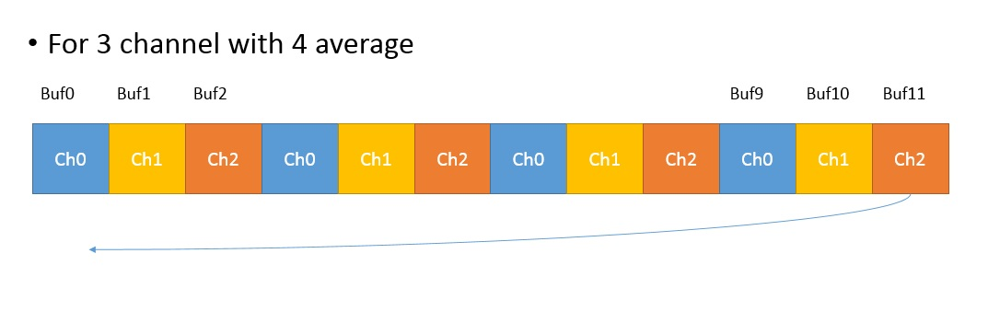

# Industrial trick for multiple ADC with DMA in STM32 without interrupt

In this project you generate and configure ADC module of STM32 with DMA.

Your code read ADCs without delay, with best resolution.

## features:
* No interrupt generated in the system
* No delay for data reading ADC during application running on MCU
* Better resolution because of averaging. 1 or 1.5 bit better than any single ADC read.( Read this: AVR121: Enhancing ADC resolution by
oversampling)
* You can run any advance filtering for ADC noise removal
* You can read multiple channels without problem

# Methods
1. Configure ADC for X channel with DMA without Interrupt (**DMA should be in circular Mode**)
2. In software for Y point for averaging of each channel, request HAL_ADC_Start_DMA with X*Y point
3. When you want to read a channel known point in memory, without checking ADC status.

In the picture, always you can find the first channel of ADC in BUF0, BUF3, BUF6, BUF9.
Always you can add these value for measuring the ADC value.

# Limitation
* These method works for reading voltage or temperature or any sensor with limited rate. It is very accurate because of averaging the data.
* ADC trigger should be controlled, It may saturate system bus.

# Test
This project test on "Nucleo board F746ZG". ADC_DMA.ioc file related to this implementation. 3 channels ADC with 8 sample average on each channel set on the board.
